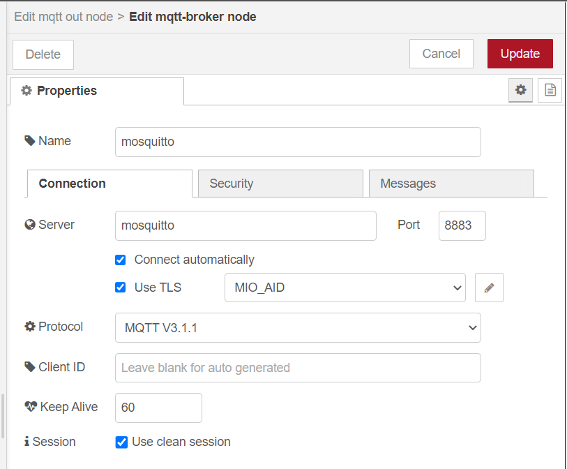

## Configuration for the use ofe TLS/SSL certificates ##

The certificates are stored in:
```
/home/pi/ACME/certificates
```

The files *ca.crt*, *mio_aid.crt* and *mio_aid.key* have to be moved to the specific directories of:
1. Mosquitto
2. ACME CSE
3. Zigbee2MQTT

Furthermore the configuration of the applications has to be adapted.

### 1. Mosquitto ###
Copy files to:
```
/var/lib/docker/volumes/acme_mosquittoConfigVolume/_data/
```

Add lines to configuration file *mosquitto.conf*:
```
listener 8883                                 # listening on Port 8883
cafile /mosquitto/config/ca.crt               # Path to the CA.crt file
certfile /mosquitto/config/mio_aid.crt        # Path to the PEM encoded server certificate.
keyfile /mosquitto/config/mio_aid_public.pem  # Path to the PEM encoded keyfile.

```

### 2. ACME CSE ###
Copy files to:
```
/var/lib/docker/volumes/acme_mosquittoConfigVolume/_data/
```


### 3. Zigbee2MQTT ###
Copy files to:
```
/var/lib/docker/volumes/acme_mosquittoConfigVolume/_data/
```

### 4. Node Red ###
Edit the settings for "mosquitto" MQTT-Broker

1. Change the port to 8333:



2. Upload certificates:

