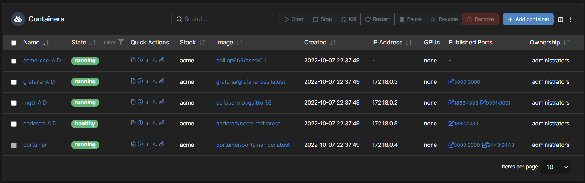

# KETI-MIO-AID

## Raspberry Config
### Network
- **IP-Address:** 192.168.1.121
- **Hostname:** rpidockal
- **User:** pi
- **Password:** ******

### Grafana
- **Port:** 3000

### Zigbee2MQTT
- **Ports:** 8883, 9001

### NodeRed
- **Port:** 1880

### Acme CSE
- **Port:** 3000

### Installation via docker-compose
`docker-compose up -d`



## Sensor Node Config
### SCD30 Sensor

[Seeedstudio Grove SCD30](https://wiki.seeedstudio.com/Grove-CO2_Temperature_Humidity_Sensor-SCD30/)

## Brainstorming CSE
### Data Management
- application AE: aqm (air quality management)
- container: room1, room2
- flex container: device classes (devAct, devSd, devAir), module classes (cod:binSh, cod:sigSh, mio:coSLd, mio:aiQSr)

### Authorization
- access control policies: acp_admin, acp_room1, acp_room2

### Subscription/Notification
- Notification Server on Port 9999
- <subscription> resource: CRUD

**Notification**
- Attributes: eventNotifocationCriteria, notificationURI, ...
- Notification Target: 
```
localhost:9999 (ContentType = JSON)
``` 

**Subscription**
- Event Type: target update, target delete, child creation, ...

**Aggregated Notification**
- subscription reference
- notification event: notification event type, representation
- content instance: name, type, content

### AE Registration <AE> Resource
- Attributes: appName, App-ID, AE-ID, etc.
- AE-ID Uniqueness: 
```
cse-in/airQualityMonitoring
```

### Container and contentInstance
- Attributes: maxNrOfInstances, maxByteSize, locationID, creator, ...
- Child Resources: container, subscription, latest, oldest, ...
```
cse-in/airQualityMonitoring/room1 #resource: content, creationTime, stateTag
``` 

### Rescource Discovery
- Filter conditions: createdBefore, createdAfter, modifiedSince, labels, resourceType, ...
- Discover resources created after a specific time: ```{URL}?fu=1&cra=20221008T122321```

### Group
- group of resources and its management
- attributes: memberIDs (ID of group member resources)
- e.g. Group of actuators
```
cse-in/airQualityMonitoring/gractuator
cse-in/airQualityMonitoring/grsled
```

### Procedure
1. Registration: Devices and user app (AEs) registers to the platform (CSE)
2. Initial resource creation: <acp>, <container>, <flexcontainer>, <subscription>
3. Target container discovery: group creation
4. Retrieve current sensor data (CO2, temperature, humidity) and status of the actuators (Smart LED, fan)
5. Single switch on/off Smart LED / Change Smart LED color / Activate fan --> watching notification event
6. Multiple switch on/off: group fan-out

**1. Registration**
- Sensor Node 1, Sensor Node 2, Smart LED 1, Smart LED 2, Actuator 1, Actuator 2 ```<AE>``` create request

**2. Initial resource creation**
- Sensor Node 1, Sensor Node 2, Smart LED 1, Smart LED 2, Actuator 1, Actuator 2 ```<container>, <contantInstance>, <subscription>```create request

**3. Traget container discovery**
- User app (AE): discovery request for Smart LED and Actuator control, ```<group>``` create request

**Resource Tree**
```
CSE<CSEBase>
    airQualityMonitoring<AE> *cse-in/airQualityMonitoring*
        room1<container> *cse-in/airQualityMonitoring/room1*
            mio:devAct<flexContainer> *cse-in/airQualityMonitoring/room1/actuator*
               cod:sigSh<flexContainer> *cse-in/airQualityMonitoring/room1/actuator/lqi*
               cod:binSh<flexContainer> *cse-in/airQualityMonitoring/room1/actuator/status*
            mio:devSd<flexContainer> *cse-in/airQualityMonitoring/room1/led*
               cod:sigSh<flexContainer> *cse-in/airQualityMonitoring/room1/led/lqi*
               cod:binSh<flexContainer> *cse-in/airQualityMonitoring/room1/led/status*
               cod:brigs<flexContainer> *cse-in/airQualityMonitoring/room1/led/brigs*
               mio:coSLd<flexContainer> *cse-in/airQualityMonitoring/room1/led/color*
            mio:devAir<flexContainer> *cse-in/airQualityMonitoring/room1/sensor*
               mio:aiQSr<flexContainer> *cse-in/airQualityMonitoring/room1/sensor/value*
        room2<container> *cse-in/airQualityMonitoring/room2*
            mio:devAct<flexContainer> *cse-in/airQualityMonitoring/room2/actuator*
               cod:sigSh<flexContainer> *cse-in/airQualityMonitoring/room2/actuator/lqi*
               cod:binSh<flexContainer> *cse-in/airQualityMonitoring/room2/actuator/status*
            mio:devSd<flexContainer> *cse-in/airQualityMonitoring/room2/led*
               cod:sigSh<flexContainer> *cse-in/airQualityMonitoring/room2/led/lqi*
               cod:binSh<flexContainer> *cse-in/airQualityMonitoring/room2/led/status*
               cod:brigs<flexContainer> *cse-in/airQualityMonitoring/room2/led/brigs*
               mio:coSLd<flexContainer> *cse-in/airQualityMonitoring/room2/led/color*
            mio:devAir<flexContainer> *cse-in/airQualityMonitoring/room2/sensor*
               mio:aiQSr<flexContainer> *cse-in/airQualityMonitoring/room2/sensor/value*
    userApp<AE> *tbd*
        gractuator<group> *cse-in/userApp/gractuator*
        grsled<group> *cse-in/userApp/gractuator*
```

**4. Retrieve current status**
- User app (AE): group fan-out retrieve request

**5. Single on/off**
- watching notification event
- User app (AE): ```<contenetInstance> create request``` to CSE
- CSE: ```notification request``` to actuatorControl1

**6. Multiple on/off**
- group fan-out
- User app (AE): ```group fan-out <contentInstance> create request``` to CSE
- CSE: ```notification request``` to actuatorControl1, actuatorcontrol2

## Besprechung mit Prof. Zeitlhofer 12.10.2022:
- Verwendung von MQTT (eigener MQTT-Broker im Docker) für die Kommunikation der Sensor Nodes mit der ACME CSE (MCA)
- siehe OneM2M MQTT Binding TS-0010: https://www.onem2m.org/images/files/deliverables/Release2A/TS-0010-MQTT_protocol_binding-v_2_7_1.pdf
- kein HTTP
- TLS Verschlüsselung MQTTS --> CA mit OpenSSL --> less /etc/ssl/openssl.cnf kann vorkonfiguriert werden
- Webserver für Sensor Node: Wifi SSID, Wifi Kennwort, MQTT-Einstellungen, Domain Name für Node, CSE-Einstellungen usw.
- Zigbee2mqtt für Smart LED und Aktor --> NodeRed für Topic transformieren --> transformiertes Topic an ACME-CSE mittels MQTT schicken (Alternative: Script schreiben das das Topic subscribed, transfromiert und wieder published)
- Konfiguration der ACME-CSE/mqtt: https://github.com/ankraft/ACME-oneM2M-CSE/blob/master/docs/Configuration.md#client_mqtt
- Operation der ACME-CSE/mqtt: https://github.com/ankraft/ACME-oneM2M-CSE/blob/master/docs/Operation.md#mqtt
- Blockschaltbild der Applikation bis 19.10.!
- Notification Server für "Automatisierungen"
