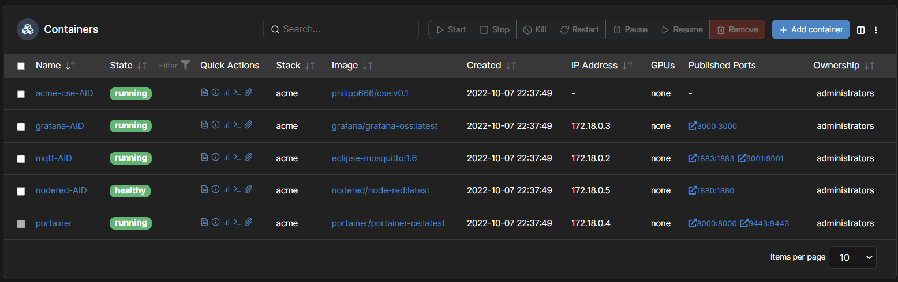

# KETI-MIO-AID

## Raspberry Config
### Network
- **IP-Address:** 192.168.1.121
- **Hostname:** rpidockal
- **User:** pi
- **Password:** ******

### Grafana
- **Port:** 3000

### Zigbee2MQTT
- **Ports:** 1883, 9001

### NodeRed
- **Port:** 1880

### Acme CSE
- **Port:** 3000

### Installation via docker-compose
`docker-compose up -d`



## Sensor Node Config
### SCD30 Sensor

[Seeedstudio Grove SCD30](https://wiki.seeedstudio.com/Grove-CO2_Temperature_Humidity_Sensor-SCD30/)

## Brainstorming CSE
### Data Management
- flex container: <flexContainer> resource: CRUD
- timeSeriesInstance: <timeSeries> resource: CRUD
### Authorization

### Subscriptin/Notification
- crate a subscription to a resource
- <subscription> resource: CRUD

**Notification**
- Attributes: eventNotifocationCriteria, notificationURI, ...
- Notification Target: http://mydomain/notificationHandler?ct=json (ContentType = JSON)

**Subscription**
- Event Type: target update, target delete, child creation, ...

**Aggregated Notification**
- subscription reference
- notification event: notification event type, representation
- content instance: name, type, content

### AE Registration <AE> Resource
- Attributes: appName, App-ID, AE-ID, etc.
- AE-ID Uniqueness: CSE_MIO_AID/AE1, AE2

### Container and contentInstance
- Attributes: maxNrOfInstances, maxByteSize, locationID, creator, ...
- Child Resources: container, subscription, latest, oldest, ...
- <contentInstance> resource: content, creationTime, stateTag, ...

### Rescource Discovery
- Filter conditions: createdBefore, createdAfter, modifiedSince, labels, resourceType, ...
- Discover resources created after a specific time: {URL}?fu=1&cra=20221008T122321

### Group
- group of resources and its management
- attributs: memberIDs (ID of group member resources)

### Procedure
1. Registration: Devices and user app (AEs) registers to the platform (CSE)
2. Initial resource creation: <container>, <contentInstance>, <subscription>
3. Target container discovery: group creation
4. Retrieve current sensor data (CO2, temperature, humidity) and status of the actuators (Smart LED, fan)
5. Single switch on/off Smart LED / Change Smart LED color / Activate fan --> watching notification event
6. Multiple switch on/off: group fan-out

**1. Registration**
- Sensor Node 1, Sensor Node 2, Smart LED 1, Smart LED 2, Actuator 1, Actuator 2 <AE> create request

**2. Initial resource creation**
- Sensor Node 1, Sensor Node 2, Smart LED 1, Smart LED 2, Actuator 1, Actuator 2 <container>, <contantInstance>, <subscription> create request

**3. Traget container discovery**
- User app (AE): discovery request for Smart LED and Actuator control, <group> create request

**Resource Tree**
```
{
CSE<CSEBase>
    room1<AE>
        cnt1<flexContainer>
            smartLEDColor1 <contentInstance>
            smartLEDStatus1 <contentInstance>
            actuatorStatus1 <contentinstance>
            co2Value1 <contentInstance>
            tempValue1 <contentInstance>
            humValue1 <contentInstance>
            sub1 <subscription>
    room2<AE>
        cnt2<flexContainer>
            smartLEDColor2 <contentInstance>
            smartLEDStatus2 <contentInstance>
            actuatorStatus2 <contentinstance>
            co2Value2 <contentInstance>
            tempValue2 <contentInstance>
            humValue2 <contentInstance>
            sub2 <subscription>
}
```